<div align="center">

# 🐍 Python for Data Analysis

### *Master Python Data Structures, SQL, and Data Science Fundamentals*

[](https://www.python.org/)
[](https://jupyter.org/)
[](https://www.mysql.com/)
[](LICENSE)

**A comprehensive learning resource for Python programming, data structures, and SQL for aspiring data scientists and analysts.**

[📚 Documentation](#-course-content) • [🚀 Getting Started](#-getting-started) • [📖 Learning Path](#-learning-path) • [🤝 Contributing](#-contributing)

</div>

---

## 📋 Table of Contents

- [Overview](#-overview)
- [Features](#-features)
- [Course Content](#-course-content)
- [Learning Path](#-learning-path)
- [Getting Started](#-getting-started)
- [Prerequisites](#-prerequisites)
- [Installation](#-installation)
- [Usage](#-usage)
- [Course Schedule](#-course-schedule)
- [Resources](#-resources)
- [Contributing](#-contributing)
- [License](#-license)
- [Contact](#-contact)

---

## 🎯 Overview

Welcome to **Python for Data Analysis** - a comprehensive, hands-on learning repository designed for aspiring data scientists, analysts, and Python enthusiasts. This repository contains carefully curated resources, practical examples, and structured learning materials covering Python fundamentals, data structures, and SQL.

### Why This Course?

- 📊 **Data Science Focused**: Learn Python specifically for data analysis and manipulation
- 🎓 **Structured Learning**: Follow a well-organized curriculum from basics to advanced topics
- 💻 **Hands-on Practice**: Practical examples and exercises using Jupyter Notebooks
- 🔄 **Real-world Applications**: Learn through real-world scenarios and use cases
- 📈 **Career Ready**: Build skills that are in high demand in the data science industry

---

## ✨ Features

<table>
<tr>
<td width="50%">

### 🐍 Python Fundamentals
- Variables, Data Types & Operators
- Control Flow (if-else, loops)
- Functions & Lambda Expressions
- Modules & Packages
- File Handling & Exception Handling

</td>
<td width="50%">

### 📊 Data Structures
- Lists, Tuples & Sets
- Dictionaries & Advanced Collections
- String Manipulation & Regex
- Data Structure Operations
- Performance Optimization

</td>
</tr>
<tr>
<td width="50%">

### 🗄️ SQL Mastery
- Database Fundamentals
- CRUD Operations (SELECT, INSERT, UPDATE, DELETE)
- Joins & Subqueries
- Aggregate Functions & GROUP BY
- DDL & DML Commands

</td>
<td width="50%">

### 🔧 Tools & Environment
- Jupyter Notebook Setup
- Python IDEs (PyCharm, VS Code)
- Package Management (pip, conda)
- Version Control Best Practices
- Debugging Techniques

</td>
</tr>
</table>

---

## 📚 Course Content

### 📂 Repository Structure

```
Python_For_Data_Analysis/
│
├── 📁 Python-data-essentials-data-structures/
│   ├── 📄 Python Part 2
│   ├── 📄 Python Strings and Regex
│   └── 📄 Readme for Python Data Essentials - Python Introduction.md
│
└── 📄 README.md (You are here!)
```

### 🎓 Main Modules

#### 1️⃣ **Python Data Essentials - Introduction**
Comprehensive guide covering Python basics, installation, IDEs, and fundamental concepts.

[📖 View Full Introduction Guide](./Python-data-essentials-data-structures/Readme%20for%20Python%20Data%20Essentials%20-%20Python%20Introduction.md)

**Topics Covered:**
- Python & Data Science Overview
- Installing Python (Windows/Mac)
- Jupyter Notebook Setup
- Identifiers, Literals & Expressions
- Operators (Arithmetic, Comparison, Logical)
- Python Packages & PyPI

#### 2️⃣ **Data Structures Deep Dive**
Master Python's built-in data structures with practical examples.

**Topics Covered:**
- **Lists**: Creation, indexing, slicing, methods, and mutability
- **Tuples**: Immutable sequences and use cases
- **Sets**: Unique collections and set operations
- **Dictionaries**: Key-value pairs and advanced operations
- **Strings**: Manipulation, formatting, and regex patterns

#### 3️⃣ **SQL for Data Analysis**
Learn SQL from scratch with the IMDB dataset.

**Topics Covered:**
- Database concepts and MySQL installation
- SELECT, WHERE, ORDER BY, LIMIT
- Aggregate functions (COUNT, SUM, AVG, MIN, MAX)
- GROUP BY and HAVING clauses
- Joins (INNER, LEFT, RIGHT, OUTER)
- Subqueries and nested queries
- DDL & DML operations

---

## 🛤️ Learning Path



```mermaid
graph LR
    A[Python Basics] --> B[Data Structures]
    B --> C[Functions & Modules]
    C --> D[File Handling]
    D --> E[SQL Fundamentals]
    E --> F[Advanced SQL]
    F --> G[Data Analysis Ready!]
    
    style A fill:#3776AB,color:#fff
    style B fill:#3776AB,color:#fff
    style C fill:#3776AB,color:#fff
    style D fill:#3776AB,color:#fff
    style E fill:#4479A1,color:#fff
    style F fill:#4479A1,color:#fff
    style G fill:#2ecc71,color:#fff
```

### Recommended Study Sequence

1. **Week 1-2**: Python Fundamentals (Variables, Operators, Control Flow)
2. **Week 3**: Data Structures (Lists, Tuples, Sets, Dictionaries)
3. **Week 4**: Functions, Modules & Packages
4. **Week 5**: File Handling & Exception Handling
5. **Week 6-7**: SQL Fundamentals & Advanced Queries

---

## 🚀 Getting Started

### Prerequisites

Before you begin, ensure you have:

- 💻 A computer running Windows, macOS, or Linux
- 🌐 Internet connection for downloading packages
- 📝 Basic understanding of programming concepts (helpful but not required)
- ⏰ Commitment to practice regularly

### Installation

#### 1. Install Python

**Windows:**
```bash
# Open PowerShell and run:
python3 --version

# If not installed, download from:
# https://www.python.org/downloads/
```

**macOS:**
```bash
# Open Terminal and run:
python3 --version

# If not installed, use Homebrew:
brew install python3
```

**Linux:**
```bash
# Ubuntu/Debian
sudo apt update
sudo apt install python3 python3-pip

# Fedora
sudo dnf install python3 python3-pip
```

#### 2. Install Jupyter Notebook

```bash
# Using pip
pip install jupyter

# Or install Anaconda (recommended for data science)
# Download from: https://www.anaconda.com/products/distribution
```

#### 3. Install MySQL (for SQL modules)

```bash
# macOS
brew install mysql

# Windows - Download from:
# https://dev.mysql.com/downloads/installer/

# Linux
sudo apt install mysql-server
```

#### 4. Clone This Repository

```bash
git clone https://github.com/AbhijayG1992/Python_For_Data_Analysis.git
cd Python_For_Data_Analysis
```

---

## 💡 Usage

### Starting Jupyter Notebook

```bash
# Navigate to the repository directory
cd Python_For_Data_Analysis

# Launch Jupyter Notebook
jupyter notebook
```

Your browser will open automatically with the Jupyter interface. Navigate to the `Python-data-essentials-data-structures` folder to access the learning materials.

### Running Python Scripts

```bash
# Run a Python file
python3 script_name.py

# Or use Python interactive shell
python3
>>> print("Hello, Data Science!")
```

### Installing Additional Packages

```bash
# Install a package using pip
pip install package_name

# Example: Install pandas for data analysis
pip install pandas numpy matplotlib
```

---

## 📅 Course Schedule

### 🐍 Python Module (Days 1-7)

| Day | Topics | Duration |
|-----|--------|----------|
| **Day 1** | Keywords, Identifiers, Variables, Data Types, I/O, Operators, if-else | 4-6 hours |
| **Day 2** | Loops (while, for), break, continue, Python Basics Revision | 4-6 hours |
| **Day 3** | Lists, Tuples, Sets, Dictionaries | 4-6 hours |
| **Day 4** | Strings, Data Structures Revision | 4-6 hours |
| **Day 5** | Functions, Function Arguments, Recursion | 4-6 hours |
| **Day 6** | Lambda Functions, Modules, Packages, File Handling | 4-6 hours |
| **Day 7** | Exception Handling, Debugging, Functions Revision | 4-6 hours |

### 🗄️ SQL Module (Days 8-12)

| Day | Topics | Duration |
|-----|--------|----------|
| **Day 8** | Database Intro, MySQL Installation, IMDB Dataset, SELECT, DESCRIBE | 4-6 hours |
| **Day 9** | LIMIT, OFFSET, ORDER BY, DISTINCT, WHERE | 4-6 hours |
| **Day 10** | Comparison Operators, NULL, Logical Operators, Aggregate Functions | 4-6 hours |
| **Day 11** | GROUP BY, HAVING, Joins (INNER, LEFT, RIGHT, OUTER) | 4-6 hours |
| **Day 12** | Subqueries, DML (INSERT, UPDATE, DELETE), DDL (CREATE, ALTER, DROP) | 4-6 hours |

---

## 📖 Resources

### 📚 Official Documentation
- [Python Official Documentation](https://docs.python.org/3/)
- [Jupyter Notebook Documentation](https://jupyter-notebook.readthedocs.io/)
- [MySQL Documentation](https://dev.mysql.com/doc/)

### 🎓 Additional Learning Materials
- [Python Package Index (PyPI)](https://pypi.org/)
- [Real Python Tutorials](https://realpython.com/)
- [W3Schools Python](https://www.w3schools.com/python/)
- [SQLZoo](https://sqlzoo.net/)

### 🔧 Recommended Tools
- **IDEs**: PyCharm, Visual Studio Code, Jupyter Notebook
- **Package Managers**: pip, conda
- **Version Control**: Git, GitHub
- **Database Tools**: MySQL Workbench, DBeaver

---

## 🤝 Contributing

Contributions are welcome! Whether it's fixing typos, adding examples, or improving documentation, your help makes this resource better for everyone.

### How to Contribute

1. **Fork** the repository
2. **Create** a new branch (`git checkout -b feature/improvement`)
3. **Make** your changes
4. **Commit** your changes (`git commit -m 'Add some improvement'`)
5. **Push** to the branch (`git push origin feature/improvement`)
6. **Open** a Pull Request

### Contribution Guidelines

- Ensure code examples are tested and working
- Follow Python PEP 8 style guidelines
- Add comments to explain complex concepts
- Update documentation when adding new content

---

## 📄 License

This project is licensed under the MIT License - see the [LICENSE](LICENSE) file for details.

---

## 📧 Contact

**Abhijay Ghadyale**

- 🐙 GitHub: [@AbhijayG1992](https://github.com/AbhijayG1992)
- 📧 Email: aiabhijayapg11@gmail.com
- 💼 LinkedIn: https://www.linkedin.com/in/abhijay-ghadyale-20628a39/

---

<div align="center">

### ⭐ If you find this repository helpful, please consider giving it a star!

**Happy Learning! 🚀**

*Made with ❤️ for aspiring Data Scientists*

---

**[⬆ Back to Top](#-python-for-data-analysis)**

</div>
