```mermaid
graph LR
    A[Python Basics] --> B[Data Structures]
    B --> C[Functions & Modules]
    C --> D[OOP Concepts]
    D --> E[File Handling]
    E --> F[Regular Expressions]
    F --> G[Data Analysis Ready!]
    
    style A fill:#3776AB,color:#fff
    style B fill:#3776AB,color:#fff
    style C fill:#3776AB,color:#fff
    style D fill:#3776AB,color:#fff
    style E fill:#3776AB,color:#fff
    style F fill:#F37626,color:#fff
    style G fill:#2ecc71,color:#fff
```

<div align="center">

# 🐍 Python for Data Analysis

### *Master Python Data Structures, SQL, and Data Science Fundamentals*

[](https://www.python.org/)
[](https://jupyter.org/)
[](https://www.mysql.com/)
[](LICENSE)

**A comprehensive learning resource for Python programming, data structures, and SQL for aspiring data scientists and analysts.**

[📚 Documentation](#-course-content) • [🚀 Getting Started](#-getting-started) • [📖 Learning Path](#-learning-path) • [🤝 Contributing](#-contributing)

</div>

---

## 📋 Table of Contents

- [Overview](#-overview)
- [Features](#-features)
- [Course Content](#-course-content)
- [Learning Path](#-learning-path)
- [Getting Started](#-getting-started)
- [Prerequisites](#-prerequisites)
- [Installation](#-installation)
- [Usage](#-usage)
- [Course Schedule](#-course-schedule)
- [Resources](#-resources)
- [Contributing](#-contributing)
- [License](#-license)
- [Contact](#-contact)

---

## 🎯 Overview

Welcome to **Python for Data Analysis** - a comprehensive, hands-on learning repository designed for aspiring data scientists, analysts, and Python enthusiasts. This repository contains carefully curated resources, practical examples, and structured learning materials covering Python fundamentals, data structures, and SQL.

### Why This Course?

- 📊 **Data Science Focused**: Learn Python specifically for data analysis and manipulation
- 🎓 **Structured Learning**: Follow a well-organized curriculum from basics to advanced topics
- 💻 **Hands-on Practice**: Practical examples and exercises using Jupyter Notebooks
- 🔄 **Real-world Applications**: Learn through real-world scenarios and use cases
- 📈 **Career Ready**: Build skills that are in high demand in the data science industry

---

## ✨ Features

<table>
<tr>
<td width="50%">

### 🐍 Python Fundamentals
- Variables, Data Types & Operators
- Control Flow (if-else, loops)
- Functions & Lambda Expressions
- Modules & Packages
- File Handling & Exception Handling

</td>
<td width="50%">

### 📊 Data Structures
- Lists, Tuples & Sets
- Dictionaries & Nested Structures
- String Manipulation & Methods
- Data Structure Operations
- Practical Applications

</td>
</tr>
<tr>
<td width="50%">

### 🎯 Object-Oriented Programming
- Classes & Objects
- Inheritance & Polymorphism
- Method Overriding
- Constructor Methods
- Real-world OOP Projects

</td>
<td width="50%">

### � Regex & Text Processing
- Pattern Matching & Validation
- Data Extraction & Parsing
- Text Cleaning & Sanitization
- Advanced Regex Techniques
- Web APIs & JSON Handling

</td>
</tr>
</table>

---

## 📚 Course Content

### 📂 Repository Structure

```
Python_For_Data_Analysis/
│
├── 📁 Python-data-essentials-data-structures/
│   ├── 📄 Python-Data-Science-Introduction.md
│   ├── 📄 Python-Fundamentals-Complete-Guide.md
│   └── 📄 Python-Regex-Complete-Guide.md
│
└── 📄 README.md (You are here!)
```

### 🎓 Main Modules

#### 1️⃣ **Python Data Science - Introduction**
Comprehensive guide covering Python basics, installation, IDEs, and fundamental concepts for data science.

[📖 View Python Data Science Introduction](./Python-data-essentials-data-structures/Python-Data-Science-Introduction.md)

**Topics Covered:**
- Python & Data Science Overview
- Installing Python (Windows/Mac/Linux)
- Jupyter Notebook Setup & Usage
- Python IDEs (PyCharm, VS Code, Jupyter)
- Identifiers, Literals & Expressions
- Operators (Arithmetic, Comparison, Logical)
- Python Packages & PyPI
- Data Structures (Lists, Tuples, Sets, Dictionaries)

#### 2️⃣ **Python Fundamentals - Complete Guide**
Detailed course notes covering Python 3 fundamentals with hands-on projects and practical examples.

[📖 View Python Fundamentals Guide](./Python-data-essentials-data-structures/Python-Fundamentals-Complete-Guide.md)

**Topics Covered:**
- Variables, Data Types & Type Conversion
- Strings, Input/Output Operations
- Conditionals (if/elif/else) & Imports
- Lists, Loops & the range() Function
- Dictionaries, JSON & Web APIs
- Functions & Variable Scope
- Classes, Objects & OOP Concepts
- File Handling & Exception Management
- Package Management with pip & Virtual Environments

**Hands-on Projects:**
- Tax Calculator
- Age Calculator
- Rock, Paper, Scissors Game
- Loan Calculator
- Weather Reader (API Integration)
- File Organizer

#### 3️⃣ **Regular Expressions (Regex) - Complete Guide**
Master regular expressions in Python for pattern matching, data validation, and text processing.

[📖 View Regex Complete Guide](./Python-data-essentials-data-structures/Python-Regex-Complete-Guide.md)

**Topics Covered:**
- Regular Expression Basics & Special Characters
- Character Classes & Shorthand Notation
- Quantifiers & Repetition Patterns
- Python `re` Module Functions (search, match, findall, sub, split)
- Match Objects & Capturing Groups
- Regex Flags (IGNORECASE, MULTILINE, DOTALL)
- Parsing & Extracting Data from Files
- Data Validation & Input Sanitization
- Lookahead & Lookbehind Assertions
- Greedy vs Non-Greedy Matching
- Text Cleaning & Transformation
- Redacting Sensitive Information
- Performance Optimization Tips

**Practical Applications:**
- Email & Phone Number Validation
- URL Pattern Matching
- Product Code Extraction
- HTML Tag Parsing
- Credit Card Redaction
- Log File Analysis
- Data Cleaning for NLP

---

## 🛤️ Learning Path



### Recommended Study Sequence

1. **Week 1**: Python Basics & Data Science Introduction
   - Python installation and setup
   - Variables, data types, and operators
   - Basic input/output operations

2. **Week 2**: Control Flow & Data Structures
   - Conditionals (if/elif/else)
   - Loops (for, while)
   - Lists, tuples, sets, and dictionaries

3. **Week 3**: Functions & Modules
   - Defining and calling functions
   - Parameters and return values
   - Importing and using modules
   - Package management with pip

4. **Week 4**: Object-Oriented Programming
   - Classes and objects
   - Inheritance and polymorphism
   - Building practical OOP projects

5. **Week 5**: File Handling & APIs
   - Reading and writing files
   - Exception handling
   - Working with JSON
   - Making web requests to APIs

6. **Week 6**: Regular Expressions Mastery
   - Regex patterns and syntax
   - Data validation and sanitization
   - Text processing and cleaning
   - Advanced pattern matching techniques

---

## 🚀 Getting Started

### Prerequisites

Before you begin, ensure you have:

- 💻 A computer running Windows, macOS, or Linux
- 🌐 Internet connection for downloading packages
- 📝 Basic understanding of programming concepts (helpful but not required)
- ⏰ Commitment to practice regularly

### Installation

#### 1. Install Python

**Windows:**
```bash
# Open PowerShell and run:
python3 --version

# If not installed, download from:
# https://www.python.org/downloads/
```

**macOS:**
```bash
# Open Terminal and run:
python3 --version

# If not installed, use Homebrew:
brew install python3
```

**Linux:**
```bash
# Ubuntu/Debian
sudo apt update
sudo apt install python3 python3-pip

# Fedora
sudo dnf install python3 python3-pip
```

#### 2. Install Jupyter Notebook

```bash
# Using pip
pip install jupyter

# Or install Anaconda (recommended for data science)
# Download from: https://www.anaconda.com/products/distribution
```

#### 3. Clone This Repository

```bash
git clone https://github.com/AbhijayG1992/Python_For_Data_Analysis.git
cd Python_For_Data_Analysis
```

---

## 💡 Usage

### Starting Jupyter Notebook

```bash
# Navigate to the repository directory
cd Python_For_Data_Analysis

# Launch Jupyter Notebook
jupyter notebook
```

Your browser will open automatically with the Jupyter interface. Navigate to the `Python-data-essentials-data-structures` folder to access the learning materials.

### Running Python Scripts

```bash
# Run a Python file
python3 script_name.py

# Or use Python interactive shell
python3
>>> print("Hello, Data Science!")
```

### Installing Additional Packages

```bash
# Install a package using pip
pip install package_name

# Example: Install pandas for data analysis
pip install pandas numpy matplotlib
```

---

## 📅 Course Schedule

### 🐍 Python Fundamentals (Weeks 1-3)

| Week | Module | Topics | Duration |
|------|--------|--------|----------|
| **Week 1** | Getting Started | Python installation, IDEs, Variables, Data types, Operators | 8-10 hours |
| **Week 1** | Strings & I/O | String manipulation, Input/output, Type conversion | 4-6 hours |
| **Week 2** | Control Flow | Conditionals (if/elif/else), Logical operators, Imports | 6-8 hours |
| **Week 2** | Lists & Loops | Lists, For loops, range() function, List methods | 6-8 hours |
| **Week 3** | Dictionaries & Data | Dictionaries, JSON, Web APIs, requests library | 6-8 hours |
| **Week 3** | Functions | Function definition, Parameters, Return values, Scope | 6-8 hours |

### 🎯 Advanced Python (Weeks 4-5)

| Week | Module | Topics | Duration |
|------|--------|--------|----------|
| **Week 4** | OOP Basics | Classes, Objects, __init__ method, self parameter | 6-8 hours |
| **Week 4** | OOP Advanced | Inheritance, Method overriding, super() function | 6-8 hours |
| **Week 5** | File Handling | Reading/writing files, File paths, with statement | 4-6 hours |
| **Week 5** | Exceptions | try/except blocks, Exception handling, finally clause | 4-6 hours |
| **Week 5** | File System | os module, shutil, Directory manipulation | 4-6 hours |

### � Regular Expressions (Week 6)

| Week | Module | Topics | Duration |
|------|--------|--------|----------|
| **Week 6** | Regex Basics | Literal characters, Special characters, Character classes | 4-6 hours |
| **Week 6** | Regex Patterns | Quantifiers, Anchors, Groups, Alternation | 4-6 hours |
| **Week 6** | Python re Module | search(), match(), findall(), sub(), split() | 4-6 hours |
| **Week 6** | Advanced Regex | Lookahead/Lookbehind, Greedy vs Non-greedy, Optimization | 4-6 hours |
| **Week 6** | Practical Applications | Data validation, Text cleaning, Pattern extraction | 4-6 hours |

### 📊 Hands-on Projects Timeline

| Project | Week | Skills Applied |
|---------|------|----------------|
| Tax Calculator | Week 1 | Variables, Operators, Basic I/O |
| Age Calculator | Week 1 | Type conversion, Integer division, Modulus |
| Rock, Paper, Scissors | Week 2 | Conditionals, random module, Logical operators |
| Loan Calculator | Week 2 | Loops, range(), break statement, f-strings |
| Weather Reader | Week 3 | APIs, requests library, JSON, Dictionaries |
| File Organizer | Week 5 | File handling, os module, shutil, Loops |

---

## 📖 Resources

### 📚 Official Documentation
- [Python Official Documentation](https://docs.python.org/3/)
- [Jupyter Notebook Documentation](https://jupyter-notebook.readthedocs.io/)
- [Python re Module Documentation](https://docs.python.org/3/library/re.html)
- [Python Requests Library](https://requests.readthedocs.io/)

### 🎓 Additional Learning Materials
- [Python Package Index (PyPI)](https://pypi.org/)
- [Real Python Tutorials](https://realpython.com/)
- [W3Schools Python](https://www.w3schools.com/python/)
- [Regex101 - Online Regex Tester](https://regex101.com/)
- [RegexOne - Interactive Regex Tutorial](https://regexone.com/)
- [Python OOP Tutorial](https://realpython.com/python3-object-oriented-programming/)

### 🔧 Recommended Tools
- **IDEs**: PyCharm, Visual Studio Code, Jupyter Notebook
- **Package Managers**: pip, conda (Anaconda)
- **Version Control**: Git, GitHub
- **API Testing**: Postman, HTTPie
- **Regex Tools**: Regex101, RegExr, Pythex

---

## 🤝 Contributing

Contributions are welcome! Whether it's fixing typos, adding examples, or improving documentation, your help makes this resource better for everyone.

### How to Contribute

1. **Fork** the repository
2. **Create** a new branch (`git checkout -b feature/improvement`)
3. **Make** your changes
4. **Commit** your changes (`git commit -m 'Add some improvement'`)
5. **Push** to the branch (`git push origin feature/improvement`)
6. **Open** a Pull Request

### Contribution Guidelines

- Ensure code examples are tested and working
- Follow Python PEP 8 style guidelines
- Add comments to explain complex concepts
- Update documentation when adding new content

---

## 📄 License

This project is licensed under the MIT License - see the [LICENSE](LICENSE) file for details.

---

## 📧 Contact

**Abhijay Ghadyale**

- 🐙 GitHub: [@AbhijayG1992](https://github.com/AbhijayG1992)
- 📧 Email: aiabhijayapg11@gmail.com
- 💼 LinkedIn: https://www.linkedin.com/in/abhijay-ghadyale-20628a39/

---

<div align="center">

### ⭐ If you find this repository helpful, please consider giving it a star!

**Happy Learning! 🚀**

*Made with ❤️ for aspiring Data Scientists*

---

**[⬆ Back to Top](#-python-for-data-analysis)**

</div>
